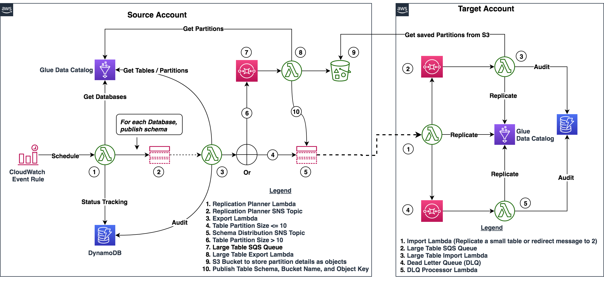

# AWS Glue Data Catalog Replication Utility

This Utility is used to replicate Glue Data Catalog from one AWS account to another AWS account. Using this tool, you can replicate Databases, Tables, and Partitions from one source AWS account to one or more target AWS accounts. It uses AWS Glue APIs / AWS SDK for Java and serverless technologies such as AWS Lambda, Amazon SQS, and Amazon SNS. The architecture of this solution is shown in the following diagram.


## Build Instructions

1. The source code has Maven nature, so if you have Maven locally then you can build it using standard Maven commands e.g. ```mvn -X clean install```. or use the options available in your IDE
2. The above step generates a Jar file e.g. aws-glue-data-catalog-replication-utility-1.0.0.jar

## AWS Service Requirements
This utility requires the following AWS services
### Source Account
 - 3 export Lambda Functions 
 - 1 Lambda Execution IAM Role
 - 3 DynamoDB tables
 - 2 SNS Topics
 - 1 SQS Queue
 - 1 S3 Bucket
 - Cross-account permissions on S3 Bucket

### Each Target Account
 - 3 import Lambda Functions 
 - 1 Lambda Execution IAM Role
 - 2 DynamoDB tables
 - 2 SQS Queues
 -  Cross-account permissions for import Lambda Function to receive messages from SNS Topic

## Lambda Functions Overview
| Class                                                         | Overview 	   |
|-------------------------------------------------------------- | -------------|	
| [GDCReplicationPlannerLambda](./src/main/java/com/amazonaws/gdcreplication/lambda/GDCReplicationPlanner.java) | Lambda Function to export list of databases from Glue Data Catalog in Source Account. | |
| [ExportLambda](./src/main/java/com/amazonaws/gdcreplication/lambda/ExportDatabaseWithTables.java) | Lambda Function to export a database and all of its tables from Glue Data Catalog in Source Account.|
| [ExportLargeTableLambda](./src/main/java/com/amazonaws/gdcreplication/lambda/ExportLargeTable.java) | Lambda Function to export a large table (table with more than 10 partitions) from Glue Data Catalog in Source Account.|
| [ImportLambda](./src/main/java/com/amazonaws/gdcreplication/lambda/ImportDatabaseOrTable.java) | Lambda Function to import a database or a table to Glue Data Catalog in Target Account.|
| [ImportLargeTableLambda](./src/main/java/com/amazonaws/gdcreplication/lambda/ImportLargeTable.java) | Lambda Function to import a large table to Glue Data Catalog in Target Account.|
| [DLQProcessorLambda](./src/main/java/com/amazonaws/gdcreplication/lambda/DLQImportDatabaseOrTable.java) | Dead Letter Queue Processing - Lambda Function to import a database or a table to Glue Data Catalog in Target Account.| 

## AWS Lambda Environment Variables Summary
### GDCReplicationPlannerLambda
| Variable Name                    	| Variable Value          	|
|----------------------------------	|-------------------------	|
| source_glue_catalog_id           	| Source AWS Account Id      |
| ddb_name_gdc_replication_planner 	| Name of the DDB Table      |
| database_prefix_list             	| e.g. raw_data_,processed_data_ The list of database prefixes to be replicated. |
| separator                        	| e.g. ,                       	|
| region                           	| e.g. us-east-1               	|
| sns_topic_arn_gdc_replication_planner |  Name of the SNS Topic   |

### ExportLambda
| Variable Name                    	| Variable Value          	|
|----------------------------------	|-------------------------	|
| source_glue_catalog_id           	| Source AWS Account Id     	|
| ddb_name_db_export_status 	        | Name of the DDB Table     |
| ddb_name_table_export_status       | Name of the DDB Table     |
| region             	            | e.g. us-east-1  	       |
| sns_topic_arn_export_dbs_tables    | Name of the SNS Topic    |

### ExportLargeTableLambda
| Variable Name                    	| Variable Value          	|
|----------------------------------	|-------------------------	|
| s3_bucket_name 	                | Name of the S3 Bucket used to save partitions for large Tables |
| ddb_name_table_export_status       | Name of the DDB Table     |
| region             	            | e.g. us-east-1  	       |
| sns_topic_arn_export_dbs_tables    | Name of the SNS Topic    |

### ImportLambda
| Variable Name                    	| Variable Value          	|
|----------------------------------	|-------------------------	|
| target_glue_catalog_id           	| Target AWS Account Id    	|
| ddb_name_db_import_status 	        | Name of the DDB Table      |
| ddb_name_table_import_status       | Name of the DDB Table  |
| skip_archive             	        | true 	                 |
| dlq_url_sqs                        | Name of the SQS Queue  |
| region             	            | e.g. us-east-1  	     |

### ImportLargeTableLambda
| Variable Name                    	| Variable Value         |
|----------------------------------	|----------------------	 |
| target_glue_catalog_id           	| Target AWS Account Id  |
| ddb_name_table_import_status      | Name of the DDB Table  |
| skip_archive             	        | true 	                 |
| region             	            | e.g. us-east-1  	     |

### DLQProcessorLambda
| Variable Name                    	| Variable Value          |
|----------------------------------	|-------------------------	|
| target_glue_catalog_id             | Target AWS Account Id     |
| ddb_name_db_import_status 	        | Name of the DDB Table     |
| ddb_name_table_import_status       | Name of the DDB Table    |
| skip_archive             	        | true 	                    |
| dlq_url_sqs                        | Name of the SQS Queue   |
| region             	            | e.g. us-east-1  	      |

## DynamoDB Tables
| Table             | Description 	 |  Account   | Schema 	    |  Capacity      | 
|-------------------|----------------|------------|------------ | -------------- |
| glue_database_export_task | audit data for replication planner | source account | Partition key - db_id (String), Sort key - export_run_id (Number) | On-Demand |
| db_status | audit data for databases exported | source account | Partition key - db_id (String), Sort key - export_run_id (Number) | On-Demand |
| table_status | audit data for tables exported | source account | Partition key - table_id (String), Sort key - export_run_id (Number) | On-Demand |
| db_status | audit data for databases imported | target account | Partition key - db_id (String), Sort key - import_run_id (Number) | On-Demand |
| table_status | audit data for tables imported | target account | Partition key - table_id (String), Sort key - import_run_id (Number) | On-Demand |

## Deployment Instructions - Source Account

1. Create DynamoDB tables as defined in section [DynamoDB Tables](#DynamoDB-Tables)

2. Create two SNS Topics
	1. Topic 1: Name = ```ReplicationPlannerSNSTopic```
	2. Topic 2: Name = ```SchemaDistributionSNSTopic```

3. Create an S3 Bucket. It is used to save partitions for large tables (partitions > 10)
	1. Bucket name = ```gdc-replication-large-table-schema```
	2. **Note:** This bucket must provide cross-account permissions to the IAM roles used by **ImportLargeTable** Lambda Function in Target Account. Refer the following AWS resources for more details
		1. https://aws.amazon.com/premiumsupport/knowledge-center/cross-account-access-s3/
		2. https://docs.aws.amazon.com/AmazonS3/latest/dev/example-walkthroughs-managing-access-example2.html

4. Create one SQS Queue
	1. Queue Name = ```LargeTableSQSQueue```
	2. Queue Type = Standard
	3. Default Visibility Timeout = 3 minutes 15 seconds. **Note:** It must be higher than execution timeout of **ExportLargeTable** Lambda Function

5. Create Lambda Execution IAM Role and attach it to the Lambda functions deployed in Source Account

6. Deploy **GDCReplicationPlanner** Lambda Function
   	1. Function package = Use the Jar file generated. Refer section [Build Instructions](#Build-Instructions)
   	2. Lambda Handler = ```com.amazonaws.gdcreplication.lambda.GDCReplicationPlanner```
   	3. Lambda Execution Timeout = 3 minutes
	4. Memory = 128 MB
	5. Environment variable = as defined in section [AWS Lambda Environment Variables Summary](#AWS-Lambda-Environment-Variables-Summary)

7. Deploy **ExportDatabaseWithTables** Lambda Function
   	1. Function package = Use the Jar file generated. Refer section [Build Instructions](#Build-Instructions)
   	2. Lambda Handler = ```com.amazonaws.gdcreplication.lambda.ExportDatabaseWithTables```
   	3. Lambda Execution Timeout = 3 minutes
	4. Memory = 192 MB
	5. Environment variable = as defined in section [AWS Lambda Environment Variables Summary](#AWS-Lambda-Environment-Variables-Summary)

8. Add **ReplicationPlannerSNSTopic** as a trigger to **ExportDatabaseWithTables** Lambda Function.

9. Deploy **ExportLargeTable** Lambda Function
	1. Function package = Use the Jar file generated. Refer section [Build Instructions](#Build-Instructions)
	2. Lambda Handler = ```com.amazonaws.gdcreplication.lambda.ExportLargeTable```
	3. Lambda Execution Timeout = 3 minutes
	4. Memory = 256 MB
	5. Environment variable = as defined in section [AWS Lambda Environment Variables Summary](#AWS-Lambda-Environment-Variables-Summary)

10. Add **LargeTableSQSQueue** as a trigger to **ExportLargeTable** Lambda Function
	1. Batch size = 1

11. Cross-Account permissions in Source Account. Grant permissions to Target Account to subscribe to the second SNS Topic:

	```
	aws sns add-permission --label lambda-access --aws-account-id TargetAccount \
	--topic-arn arn:aws:sns:us-east-1:SourceAccount:SchemaDistributionSNSTopic \
	--action-name Subscribe ListSubscriptionsByTopic Receive
	```

## Deployment Instructions - Target Account
	
1. Create DynamoDB tables as defined in section [DynamoDB Tables](#DynamoDB-Tables)

2. Create SQS Queue in Source Account
	1. Queue Name = ```LargeTableSQSQueue```
	2. Queue Type = Standard
	3. Default Visibility Timeout = 3 minutes 15 seconds. **Note:** It must be higher than execution timeout of **ImportLargeTable** Lambda Function

3. Create SQS Queue (Dead Letter Queue) - this is for dead letter queue processing 
	1. Queue Name = ```LargeTableSQSQueue```
	2. Queue Type = Standard
	3. Default Visibility Timeout = 20 seconds

4. Create Lambda Execution IAM Role and attach it to the Lambda functions deployed in Target Account.

5. Deploy **ImportLambda** Lambda Function
	1. Function package = Use the Jar file generated. Refer section [Build Instructions](#Build-Instructions)
	2. Lambda Handler = ```com.amazonaws.gdcreplication.lambda.ImportDatabaseOrTable```
	3. Lambda Execution Timeout = 3 minutes
	4. Memory = 192 MB
	5. Environment variable = as defined in section [AWS Lambda Environment Variables Summary](#AWS-Lambda-Environment-Variables-Summary)

6. Give **SchemaDistributionSNSTopic** permissions to invoke Lambda function
	
	```
	aws lambda add-permission --function-name ImportLambda \
	--source-arn arn:aws:sns:us-east-1:SourceAccount:SchemaDistributionSNSTopic \
	--statement-id sns-x-account --action "lambda:InvokeFunction" \
	--principal sns.amazonaws.com
	```

7. Subscribe **ImportLambda** Lambda function to **SchemaDistributionSNSTopic**
	
	```
	aws sns subscribe --protocol lambda \
	--topic-arn arn:aws:sns:us-east-1:SourceAccount:SchemaDistributionSNSTopic \
	--notification-endpoint arn:aws:lambda:us-east-1:TargetAccount:function:ImportLambda
	```
	Additional References:
	 - https://docs.aws.amazon.com/lambda/latest/dg/with-sns-example.html#with-sns-create-x-account-permissions

8. Deploy **ImportLargeTable** Lambda Function
	1. Function package = Use the Jar file generated. Refer section [Build Instructions](#Build-Instructions)
	2. Lambda Handler =  ```com.amazonaws.gdcreplication.lambda.ImportLargeTable```
	3. Lambda Execution Timeout = 3 minutes
	4. Memory = 256 MB
	5. Environment variable = as defined in section [AWS Lambda Environment Variables Summary](#AWS-Lambda-Environment-Variables-Summary)

9. Add **LargeTableSQSQueue** as a trigger to **ImportLargeTable** Lambda Function
	1. Batch size = 1

10. Deploy **DLQImportDatabaseOrTable** Lambda Function
	1. Function package = Use the Jar file generated. Refer section [Build Instructions](#Build-Instructions)
	2. Lambda Handler = ```com.amazonaws.gdcreplication.lambda.DLQImportDatabaseOrTable``` 
	3. Lambda Execution Timeout = 3 minutes
	4. Memory = 192 MB
	5. Environment variable = as defined in section [AWS Lambda Environment Variables Summary](#AWS-Lambda-Environment-Variables-Summary)

11. Add Dead Letter SQS Queue as a trigger to **DLQImportDatabaseOrTable** Lambda Function
	1. Batch size = 1

## Advantages
This solution was designed around 3 main tenets, which are simplicity, scalability, and cost-effectiveness. 
The following are direct benefits:

1.	Target AWS accounts are independent allowing the solution to scale efficiently.
2.	The target accounts always see the latest table information.
3.	Light weight and dependable at scale.
4.	The implementation is fully customizable.

## Limitations
Following are the primary limitations:
1. This utility is not intended to be used for real-time replication.
2. This utility is not intended to be used for two-way replication between AWS Accounts. 
3. This utility does not attempt to resolve database and table name conflicts which may result in undesirable behavior.

## Applicable Use Cases
### Use Case 1 - One-time Glue Data Catalog Replication from one AWS Account to one or more AWS Accounts 
To do this, you can run **GDCReplicationPlannerLambda** function using a Test event in AWS Lambda console.

### Use Case 2 - Ongoing replication of Glue Data Catalog from one AWS Account to one or more AWS Accounts 
To do this, you can create a CloudWatch Event Rule in Source Account and add **GDCReplicationPlannerLambda** as its target. 
Refer the following AWS documentation for more details:
1. [Schedule Expressions for Rules](https://docs.aws.amazon.com/AmazonCloudWatch/latest/events/ScheduledEvents.html)
2. [Tutorial: Schedule AWS Lambda Functions Using CloudWatch Events](https://docs.aws.amazon.com/AmazonCloudWatch/latest/events/RunLambdaSchedule.html)

As far as database and tables are concerned, the action taken by Import Lambdas depend on the state of Glue Data Catalog in target account. 
Those actions are summarized in the following table. 

|Input Message Type	| State in Target Glue Data Catalog | Action Taken in Target Glue Data Catalog |
|-------------------|-----------------------------------|------------  |
|Database	| Database exist already					| Skip the message |
|Database	| Database does not exist 					| Create Database  |
|Table		| Table exist already						| Update Table     | 
|Table		| Table does not exist 						| Create Table     |

As far as partitions are concerned, the process involves the following steps:

|Partitions in Export	| State in Target Glue Data Catalog | Action Taken in Target Account|
|-----------------------|-----------------------------------|------------  |
|Partitions DO NOT Exist| Target Table has no partitions	| No action taken |
|Partitions DO NOT Exist| Target Table has partitions	    | Delete current partitions |
|Partitions Exist	    | Target Table has no partitions	| Create new partitions |
|Partitions Exist	    | Target Table has partitions		| Delete current partitions, create new partitions |


## License Summary
This sample code is made available under the MIT license. See the LICENSE file.